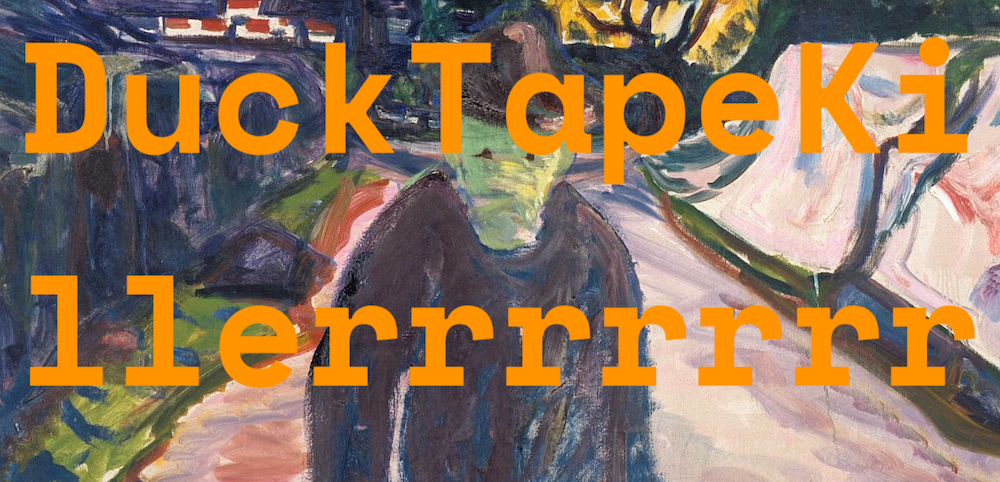

  
   

  
   

  
   

  

<!-- OBSIDIAN-PRS:START -->
| PR | Title | Status |
| :--- | :--- | :--- |
| #10016 | [Add theme: Aubade](https://github.com/obsidianmd/obsidian-releases/pull/10016) | open |
| #9569 | [Add plugin: EasyView](https://github.com/obsidianmd/obsidian-releases/pull/9569) | open |
| #9568 | [Add plugin: Bulk Tag Manager](https://github.com/obsidianmd/obsidian-releases/pull/9568) | open |
| #9567 | [Add plugin: Kindle Highlights Importer Plus](https://github.com/obsidianmd/obsidian-releases/pull/9567) | open |
| #9566 | [Add plugin: Book Search Plus](https://github.com/obsidianmd/obsidian-releases/pull/9566) | open |
| #9565 | [Add plugin: Reader Highlighter Tags](https://github.com/obsidianmd/obsidian-releases/pull/9565) | open |
<!-- OBSIDIAN-PRS:END -->

<!-- RELEASE-STATS:START -->
| Repository | Latest | Releases | Downloads | Chart |
|------------|--------|----------|-----------|-------|
| [Brutalist](https://github.com/DuckTapeKiller/Brutalist) | `v4.0.6` | 34 | 673 | `████████████████████` |
| [obsidian-aubade](https://github.com/DuckTapeKiller/obsidian-aubade) | `v3.0.4` | 25 | 663 | `████████████████████` |
| [obsidian-reader-highlighter-tags](https://github.com/DuckTapeKiller/obsidian-reader-highlighter-tags) | `1.0.1` | 2 | 266 | `████████░░░░░░░░░░░░` |
| [obsidian-book-search-plus](https://github.com/DuckTapeKiller/obsidian-book-search-plus) | `1.0.6` | 7 | 256 | `████████░░░░░░░░░░░░` |
| [obsidian-jellyfin-integration](https://github.com/DuckTapeKiller/obsidian-jellyfin-integration) | `1.0.0` | 1 | 75 | `██░░░░░░░░░░░░░░░░░░` |
| [obsidian-bulk-tag-manager](https://github.com/DuckTapeKiller/obsidian-bulk-tag-manager) | `1.0.1` | 2 | 71 | `██░░░░░░░░░░░░░░░░░░` |
| [obsidian-easyview](https://github.com/DuckTapeKiller/obsidian-easyview) | `1.0.0` | 1 | 18 | `█░░░░░░░░░░░░░░░░░░░` |
| [obsidian-kindle-importer-plus](https://github.com/DuckTapeKiller/obsidian-kindle-importer-plus) | `1.0.0` | 1 | 13 | `░░░░░░░░░░░░░░░░░░░░` |
| [obsidian-etymology-multilingual](https://github.com/DuckTapeKiller/obsidian-etymology-multilingual) | `v1.0.0` | 1 | 10 | `░░░░░░░░░░░░░░░░░░░░` |
| [obsidian-kindle-export](https://github.com/DuckTapeKiller/obsidian-kindle-export) | `1.0.0` | 1 | 6 | `░░░░░░░░░░░░░░░░░░░░` |

> **Total downloads across all releases: 2,051**
<!-- RELEASE-STATS:END -->

◉  **Stack**
   

